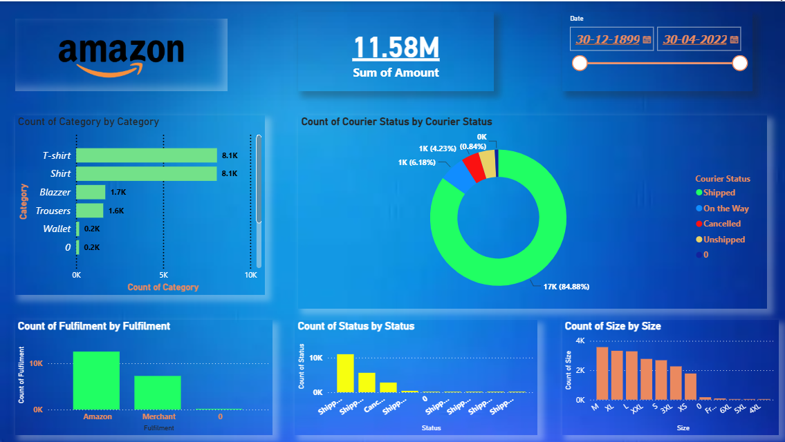

# 📊 Amazon Sales Analysis – Power BI

Interactive Power BI dashboard created to analyze **Amazon sales data**, identify trends, and generate business insights.

### 🛠️ Tools Used
- Microsoft Power BI
- Power Query
- DAX
- Data Cleaning
- Data Visualization

### 📈 Key Analysis
- Sales Performance
- Product Analysis
- Category Analysis
- Sales Trends
- KPI Dashboard

**File:** `Amazon.pbix`

**Author:** Fareez Khan

## 📸 Dashboard Preview

